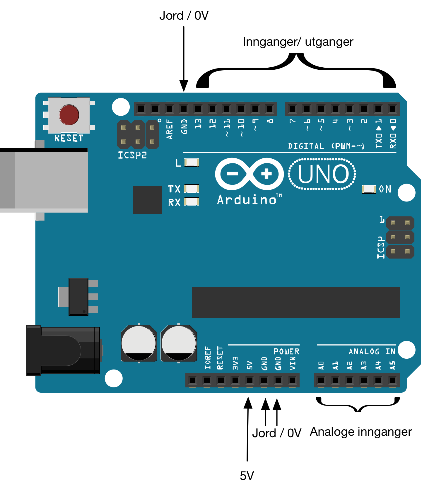

## Kom i gang

### Installasjon av Arduino IDE

Last ned programvaren her:

* [http://www.arduino.cc/en/Main/Software](http://www.arduino.cc/en/Main/Software)

Pakk ut filen på valgfritt sted og dobbeltklikk på den.

#### Mer informasjon
Mer om installasjon og intrukser for flere operativsystemer finner du her (avsnitt **Install the Arduino Desktop IDE**) :

* [http://arduino.cc/en/Guide/HomePage](http://arduino.cc/en/Guide/HomePage)

### Bli kjent med Arduinoen

Arduino en rekke innganger:

* **USB** - for tilkopling til PC/ Mac/ Linux
* **Jord / GND** - for å skape felles jordingspunkt for dine kretser
* **5V** - for å gi spenning til dine kretser
* **Innganger/ utganger**: - for å avgi eller avlese digitale signaler. 
  * **Analoge innganger** - kan måle spenning fra 0 til 5 volt
  * **Digital innganger** - kan måle enten 0  eller 5 volt (høy/ lav)
  * **Digital utganger** - kan avgi enten 0  eller 5 volt (høy/ lav)

Merk at de digitale inngangene og utgangene deler samme fysiske inngang/ utgang.

#### Mer informasjon

 * [LKK:Blinkende lysdiode](https://oppgaver.kidsakoder.no/arduino/blinkende_lysdiode/blinkende_lysdiode)
 * [circuit.io: An Introduction to arduino uno pinout](https://www.circuito.io/blog/arduino-uno-pinout/)
