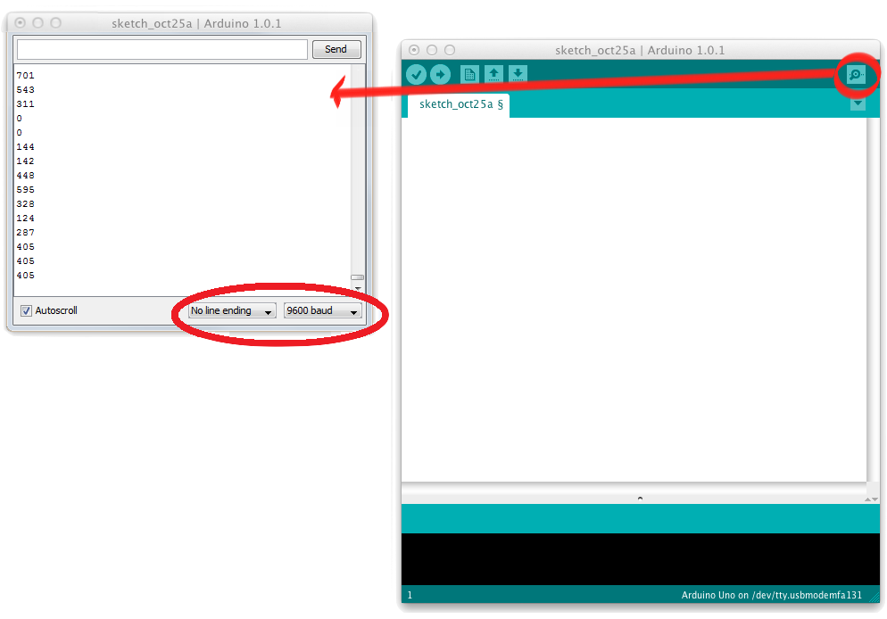

## Les potmeter


### Funksjonalitet

Arduinoen leser av potmeteret og rapporterer verdien tilbake til datamaskinen over serieport,

Potentiometeret har en variabel motstand som endrer seg når du vrir på det.

### Du trenger

| Type          | Antall           | Kommentar  |  Utseeende |
| ------------- | :------------- |:-----| ---- |
| Potmeter	| 1 | | 


### Konstruksjon


### Program

Legg inn følgende program:

```
void setup() {
  // oppsett av seriell kommunikasjon på 9600 baud
  Serial.begin(9600);
}

void loop() {
    // skriv ut verdien som leses av analog inngang 0
    Serial.println(analogRead(0));
    // vent 500 millisekunder
    delay(500);
}
```


Når programmet er lastet opp og kjører, åpne Serial Monitor, vri på potmeter og les av verdier på inngangen:




### Oppgave
I denne oppgaven skal du kontrollere lysintensiteten på en LED. 

Vi styrer intensiteten til lampen ved ved å å slå den fort av og på i høyt temp.  Dette kalles PWM eller pulse width modulation. 

Det man gjør er at man justerer forholdet mellom hvor ofte LEDen er på, og når den er av.

Eksempelkode på hvordan man lyser en led med 50% lysstyrke:

```
int ledPin = 8;
void setup() {
  pinMode(ledPin,OUTPUT);
}

void loop() {
  digitalWrite(ledPin,HIGH);
  delayMicroseconds(500);
  digitalWrite(ledPin,LOW);
  delayMicroseconds(500);
}
```

Det du skal gjøre i denne oppgaven er å:

1. Lese potmeterets verdi (du får det som en int mellom 0 og 1024.
2. Dimme LEDen tilsvarende verdien på potmeteret.

Oppkobling:


