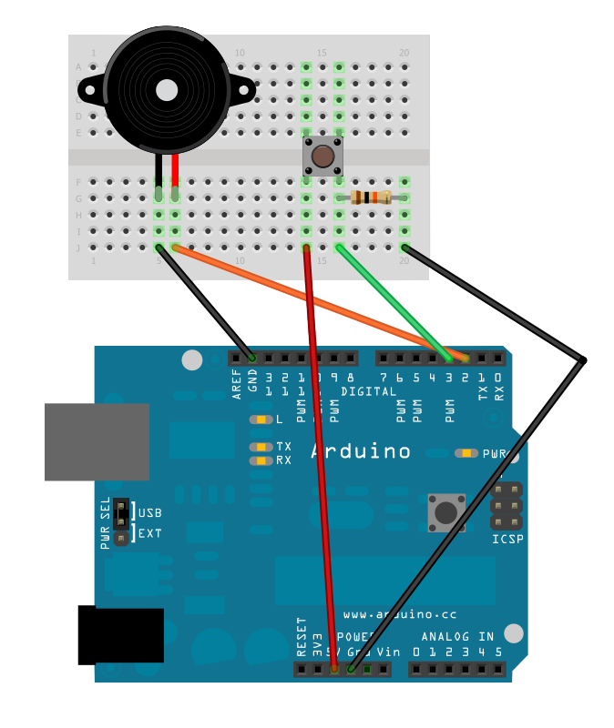

### Fasit: Lag ulyder med potmeter

#### Konstruksjon




#### Program

```
void setup() {
  pinMode(2,OUTPUT);
  pinMode(3,INPUT);
}

void loop() {
    // hvis knappen trykkes inn
    if( digitalRead(3) == HIGH ) {
      // tell fra 10 000 Hz til 1 med intervall på 10 Hz
      for( int i = 10000 ; i > 1 ; i = i - 10 ) {
        // lag en tone i 2 millisekunder
        tone(2, i ,2 );
        // vent to millisekunder så tonen får spilt ferdig
        delay(2);
      }
      // lag en mørk tone
      tone(2, 60, 500);
    }
}
} 
```
