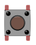

# Om kurset
Kurset gir en kort innføring i bruk av Arduino. Arduino er hardware og software bygget på åpen kildekode som gjør det enkelt å å bruke og programmerere mikrokontrollere. Kurset viser hvordan du kan lage enkle, programmerbare maskiner som kommuniserer med standard hardware som brytere, lamper, høyttalere og lyssensorer. Målet er at kurset skal gi inspirasjon til å realisere egne ideer.

## Utstyr
Du trenger dette ustyret for å gjennomføre alle oppgavene:

| Type          | Antall           |  Utseeende |
| ------------- | :------------- | :----: |
| LED           | 1    |  
| Trykkbryter	| 1	   |   |  
| Motstand 330 Ohm | 1 |   	
| Motstand 10 k Ohm | 1  |  
| Potmeter	| 1 | 
| Piezo element (høyttaler)	| 1 | 
| Servomotor	| 1 | 

I tillegg må du ha en datamaskin med Windows, Linux eller Mac. Maskinen må ha USB 2- port eller overgang til USB 2. 

## Forkunnskaper
Elementær kunnskap om programmering (Java, C, Ruby, Perl e.l.).

## Innhold

* [Kom i gang](./KomIGang/README.md)
* [Styr LED fra knapp](./StyrLEDFraKnapp/README.md)
* [Les potmeter](./LesPotmeter/README.md)
* [Lag ulyder med høyttaler](./PotmeterOgHoyttaler/README.md)
* [Styr en servo](./StyrServo/README.md)
