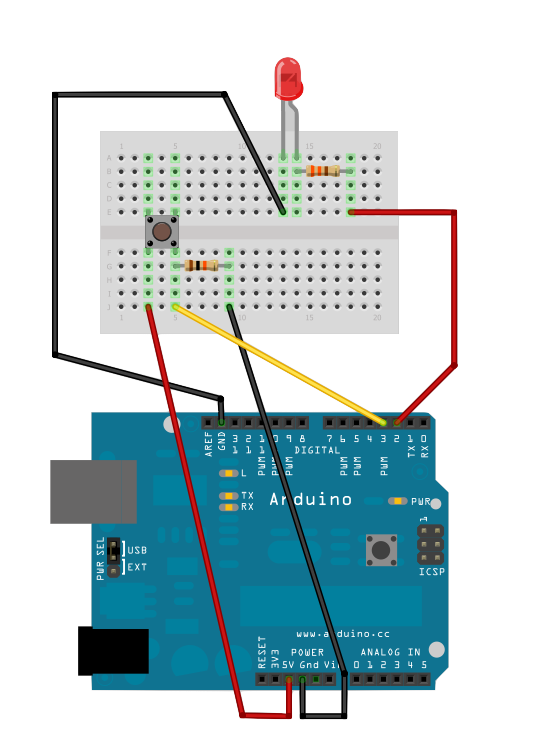

## Stye LED fra knapp

### Funksjonalitet

* Når knappen trykkes skal:
	* lampen (LED) ***tennes***
* Når knappen ***IKKE*** trykkes:
	* lampen (LED) ***slukkes***

### Du trenger


| Type          | Antall           | Kommentar  |  Utseeende |
| ------------- | :------------- |:-----| ---- |
| LED           | 1    | Lampe | 
| Trykkbryter	| 1	   |   |  
| Motstand 330 Ohm | 1 | Denne beskytter LED for for høy spenning |  	
| Motstand 10 k Ohm | 1  | Dette er en såkalt pull- down resistor. Mer info lenger ned på siden | 

### Konstruksjon




Motstanden på 10 KOhm som er koblet mellom bryter og jord er en såkalt pull- down motstand, og brukes for å "trekke" signalet ned til jord ( 0 V ). 

For mer informasjon om pull- up og pull- down, se

* [http://www.arduino.cc/en/Tutorial/DigitalPin](http://www.arduino.cc/en/Tutorial/DigitalPins)

### Program

Åpne Arduino IDE og lim inn følgende program:

```
// denne variabelen holder på status på knappen
int buttonState = 0;

void setup()  {
  // pin 2 konfigureres til å gi signaler ut til LED (OUTPUT)
  pinMode(2, OUTPUT);
  // pin 2 konfigureres til å lese verdi (INPUT) fra knapp
  pinMode(3, INPUT);
}


void loop() {
  // les verdi på knapp (av eller på)
  buttonState = digitalRead(3);
  // skriv verdi for å tenne eller slukke lampe
  digitalWrite(2, buttonState);  
}
```

Last opp programmet med funksjonen "Upload": 


Programmet skal nå bli lastet opp. Når opplastingen er ferdig, trykker du på knappen. Lampen (LED) skal da lyse.

### Oppgave

Endre programmet til å gjøre følgende:

* Når knappen trykkes inn: Lampen tennes
* Etter 2 sekunder: Lampen slukkes

Problemer? Se [fasit](./fasit.md)


