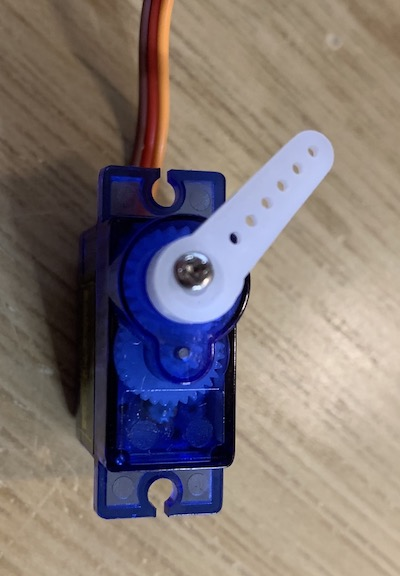

## Styr en servomotor

Servomotorer er små elektriske motorer der du kan styre vinkelen på aksen svært nøyaktig. En vanlig servo har bare 180 graders bevegelsesfrihet. Til gjengjeld vet ned alltid hvor aksen er på disse 180 gradene.

### Funksjonalitet

Servomotoren skal gå sakte en en retning og så fort som mulig i den andre retningen.

### Du trenger

| Type          | Antall           | Kommentar  |  Utseeende |
| ------------- | :------------- | :-----| :----: | 
| Servo	| 1 | Dette er motoren	 | 

Skru en arm på servoen:



Armen gjør at det er enklere å se hvilken vinkel aksen er på.

### Konstruksjon


### Program

```
#include <Servo.h>

Servo myservo;

void setup() {
  myservo.attach(9);
}

void loop() {
  for (int pos = 0; pos <= 180; pos += 1) { 
    myservo.write(pos);
    delay(15);
  }
}
``` 

### Oppgave
 
Koble til til et potmeter. Når du vrir på potmeteret, så beveger servoen på seg. Lag programmet slik at servoen
følger potmeteret, og at servoen er i samme ytterpunkt som potmeteret. 


Problemer? Se [fasit](./fasit.md)

#### Mer informasjon

Dokumentasjon på Servo Library:
* [https://www.arduino.cc/en/reference/servo](https://www.arduino.cc/en/reference/servo)


Problemer? Se [fasit](./fasit.md)


